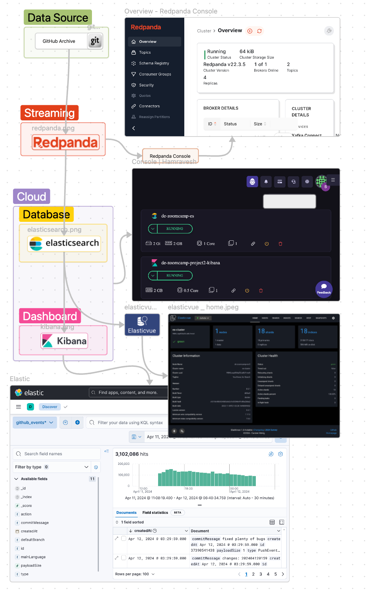
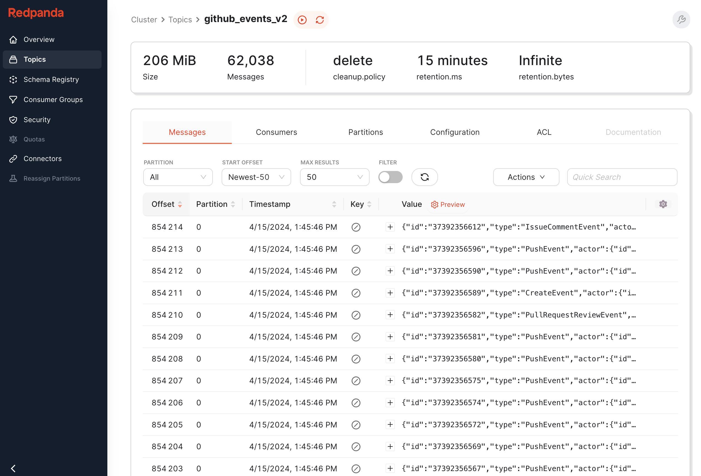
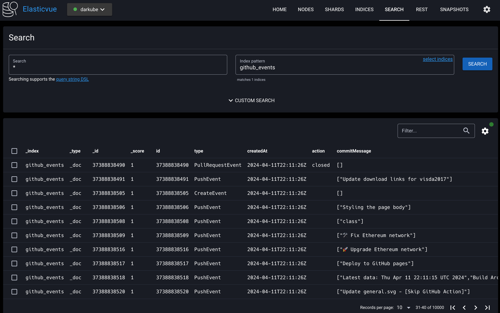
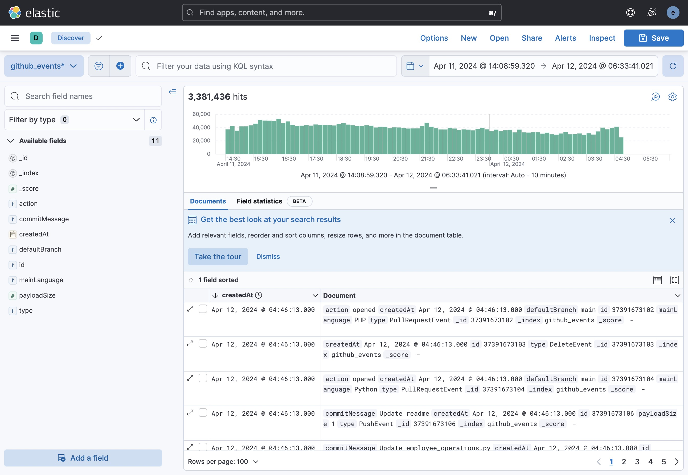
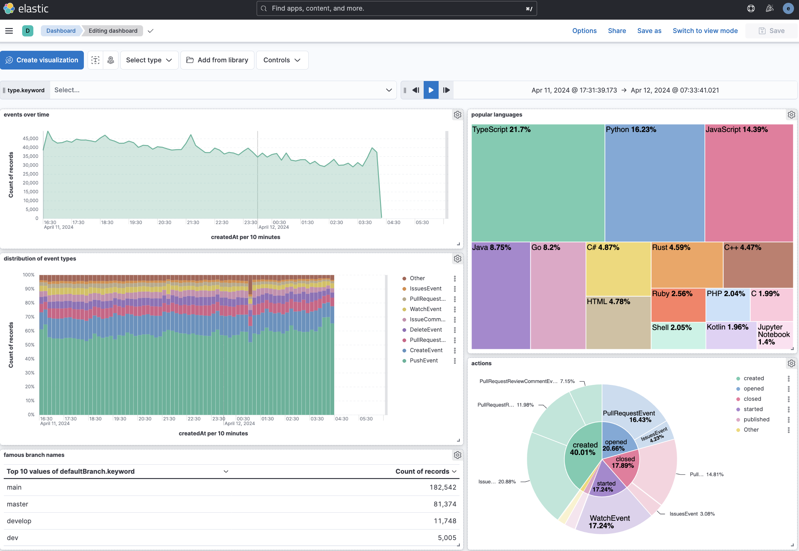

# Data Engineering Zoomcamp Project

## GitHub Events Analyzer



This project focuses on analyzing GitHub events data to gain insights and track activities within GitHub repositories.
It utilizes Java codes to download data from the [GitHub Archive site](https://www.gharchive.org/), processes it through
a Kafka pipeline, and stores
it in Elasticsearch for further analysis. The resulting data is visualized using Kibana dashboards, providing users with
a comprehensive overview of GitHub activities.

## Used Technologies

- DataBase: **Elasticsearch**
- Streaming System: **Redpanda**
- Dashboard: **Kibana**
- Monitoring: **Redpanda console** and **Elasticvue**

## Evaluation Criteria

### Problem description

GitHub hosts a vast amount of data regarding user activities, repository changes, and community interactions. Analyzing
this data efficiently can provide valuable insights into project trends, community engagement, and developer behavior.
However, managing and processing large volumes of GitHub event data in real-time poses significant challenges. This
project addresses these challenges by providing a streamlined pipeline for ingesting, processing, and visualizing GitHub
events data.

Project Structure:


## Cloud

To ensure scalability and accessibility, this project leverages cloud services for hosting Elasticsearch and Kibana
nodes. By deploying Elasticsearch and Kibana in the cloud, users can access the Kibana dashboard from anywhere via the
internet, facilitating easy data visualization and analysis.

### Data ingestion (Stream)

The data ingestion process begins by fetching GitHub events data from the GitHub Archive site
using [Java code](./src/main/java/org/example/GitHubEventsKafkaPublisher.java). This data
is then streamed to a Redpanda node using the Java Kafka client. Redpanda provides a high-performance, Kafka-compatible
streaming platform, ensuring reliable and efficient data transfer from the source to the destination.



### Database (Elasticsearch)

Elasticsearch serves as the primary database for storing and indexing the GitHub events data. Leveraging Elasticsearch's
powerful indexing and search capabilities, the processed data becomes easily searchable and retrievable. Additionally,
Elasticsearch's integration with Kibana enables seamless data visualization and exploration through custom dashboards
and visualizations.



### Data Transformations

Once the GitHub events data is published into Redpanda,
a [Java code](./src/main/java/org/example/GitHubEventElasticSearchIndexer.java) consumes the data from the
designated topic in Redpanda. This code performs necessary transformations to convert the raw event data into Java
objects containing
relevant information. These transformed records are then indexed in Elasticsearch, ensuring that the data is structured
and ready for analysis.

### Dashboard

Kibana plays a crucial role in visualizing and analyzing the processed GitHub events data. A custom dashboard is created
within Kibana to provide users with a comprehensive view of GitHub activities. Leveraging Kibana's intuitive interface
and visualization tools, users can explore trends, track changes, and gain insights into various aspects of GitHub
repositories and community interactions.



After creating the following dashboard, I attempted to compare one of the most interesting results with [this GitHub
report](https://github.blog/2023-11-08-the-state-of-open-source-and-ai/) about the state of open source in 2023.
Although I only used GitHub events data for a single day, the comparison yielded striking similarities. In the
dashboard, the top 5 most used programming languages were observed to be **1.
Typescript, 2. Python, 3. Javascript, 4. Java, and 5. Golang.** The GitHub report had a similar result, with one
difference: **Golang** was ranked 10th, and **C#** was in 5th place. However, in my analysis, **C#** occupied the 6th
place. It's
worth noting that while the GitHub report covers a full year of data, my analysis was based on a single day's worth of
data. Nonetheless, the remarkable similarity between the two datasets is both intriguing and fascinating.



you can check the kibana dashboard using this link:

- dashboard url: https://de-zoomcamp-project2-dashboard.darkube.app
- username: `visitor`
- password: `visitorpassword`

add your analysis and insights and GitHub yearly report here.

### Reproducibility

how to build:

0. install docker (or open docker desktop)
1. clone this repo using the below command

```bash
git clone https://github.com/shayansm2/DE-zoomcamp-playground.git
```

2. go to the project folder

```bash
cd DE-zoomcamp-playground/github-events-analyzer
```

3. run the following docker command

```bash
docker compose up -d
```

4. go to the java project directory and run the kafka producer

```bash
cd src/main/java/org/example/
javac GitHubEventsKafkaPublisher.java
java GitHubEventsKafkaPublisher
```

5. run the kafka consumer and elasticsearch indexer

```bash
javac GitHubEventElasticSearchIndexer.java
java GitHubEventElasticSearchIndexer
```

have in mind that you should have a running docker in your system for building this project.