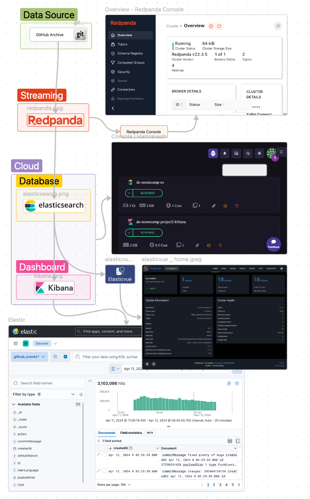
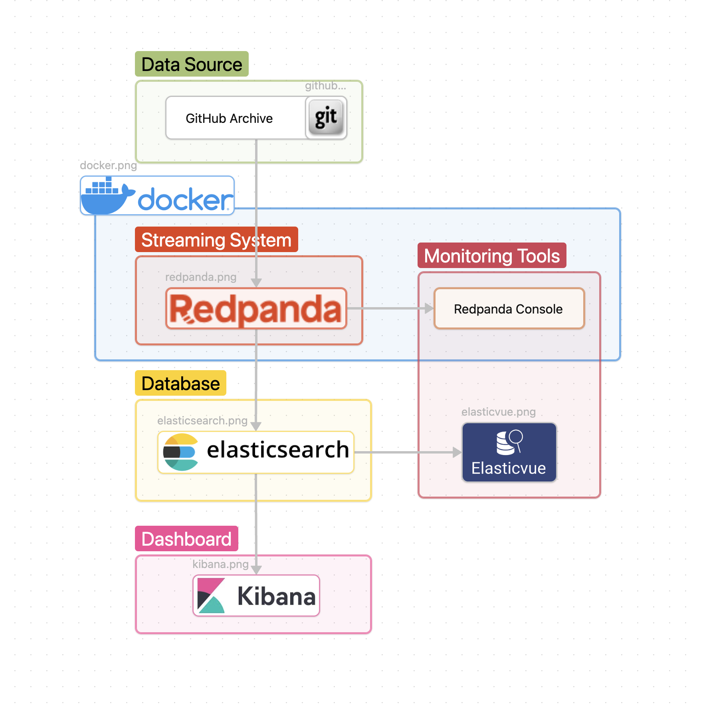

# Github Events


description

## Used Technologies

- DataBase: **Elasticsearch**
- Streaming System: **Redpanda**
- Dashboard: **Kibana**
- Monitoring: **Redpanda console** and **Elasticvue**

## Evaluation Criteria

### Problem description

Project Structure:


## Cloud

### Data ingestion (Stream)

### Data warehouse

### Transformations

### Dashboard

### Reproducibility

how to build:

1. clone this repo using the below command

```bash
git clone https://github.com/shayansm2/tech-career-explorer.git
```

2. build the project
   go to the project folder

```bash
cd tech-career-explorer
```

add execution access to build file

```bash
chmod +x build.sh
```

start building

```bash
./build.sh
```

have in mind that you should have a running docker in your system for building this project.

3. now you can check the exported ports

| link                                                                   | purpose                               |
|------------------------------------------------------------------------|---------------------------------------|
| [mage ai panel](http://localhost:6789/)                                | for checking and running pipelines    |
| [dbt docs](http://localhost:8080/)                                     | for checking dbt docs and lineage     |
| [metaase dahsboard](http://localhost:3000/dashboard/1-job-positions)   | for checking the dashboards           |
| localhost:5432                                                         | connecting to the postgresql database |
| [project board](https://github.com/users/shayansm2/projects/7/views/2) | for checking todos and done actions   |